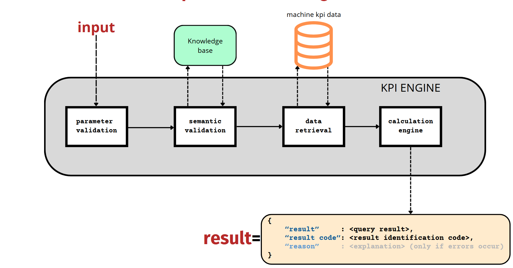

# Documentation for the KPI Engine Implementation (First Milestone)

The code and other files are available at this [link](https://github.com/mirdan08/KPI-engine).

## Current Engine Structure

The core of the first milestone implementation is the `calculate` method in the `KPIengine`.

Our interpretation of the requested milestone was a time-bounded query that groups data from KPIs and machines and performs a simple query on KPIs associated with aggregation operations applied to data from the machines.

## The KPI Engine Class

The `KPIengine` class contains the logic used to process requests. The main method in the class is `calculate(machine_id, operation, kpi_query, start_time, end_time)`. Here is the purpose of each parameter:

- **machine_id**: The ID of the machine for which data is being queried.
- **kpi_query**: The expression evaluated to perform calculations on the data.
- **operation**: The aggregation function applied to the values from the specified machine.
- **start_time**: The start of the desired time period.
- **end_time**: The end of the desired time period.

The calculation flow follows the phases in the diagram below:


The diagram is self-explanatory; however, two aspects are worth noting. In this initial development cycle, the database and knowledge base are unavailable, so they are mocked using a pandas DataFrame in the `KnowledgeBase` class. The calculations are handled by the `CalculationEngine`, which we explain further below.


## The KnowledgeBase Class

This class uses a NetworkX graph to simulate the knowledge base for the engine. The graph, created through the `get_KB()` function, is passed as an argument to the `KnowledgeBase` class.

The graph includes two types of nodes:
- **KPIs**: These nodes store KPI details in particular name, and a description.
- **Machines**: These nodes hold information like machine type, machine ID, etc.

The edges in the graph are bidirectional and indicate which KPIs are available for each machine and what aggregation functions are applicable.

The reason for this representation is that the KPIs are available in various, but not all, aggregations for each of the machines thus a check is needed to see if the values are to be changed.

### Class Description & Usage

The `KnowledgeBase` class includes methods to:
- Check if a machine with a specific ID is present in the graph.
- Query if a KPI is present in the graph.
- Verify if a specific KPI with a particular aggregation is available for a machine with a given ID.

The available KPIs are: `working_time`,`idle_time`,`offline_time`,`consumption`,`power`,`cost`,`consumption_working`,`consumption_idle`,`cycles`,`bad_cycles`,`good_cycles`,`average_cycle_time`.
The available aggregations are : `sum`,`max`,`min`,`mean`

For now only sum is available but all the other types will be available on the next milestone.


When a request is made, the engine uses this class methods the check if it possible or not to execute the requested calculation.

## The CalculationEngine Class

This class provides the calculation capabilities for the engine. The primary method, `calculate_KPIs`, parses the expression, executes the query, and returns the result. If something goes wrong during parsing (e.g., a malformed expression), it returns `None` or a descriptive string if there are errors during the elaboration of the requested query.

The class also includes `extract_KPIs`, which identifies the KPIs used in an expression to allow for the semantic validation with the knowledge base.

### KPI Calculation Expression

The expression language allows the operators `*`, `+`, `-`, `/` to be applied to both scalar values and column values (or a mix of them). For column values, functions like `mean`, `sum`, `max`, `min`, and `var` can be applied to perform the specified operation on a column.

The terms in an expression represent the KPIs used in the calculation. These terms can be treated as "column values" and combined with the functions and operators above.

#### Usage Example

Here is an example of how to use the KPI engine:

```python
from os import path
from KB import get_KB
from knowledge_base import KnowledgeBase
from kpi_engine import KPIEngine
import pandas as pd

def db_loader():
    DB_URL = path.join(".", "smart_app_data.csv")
    db = pd.read_csv(DB_URL)
    db["time"] = pd.to_datetime(db["time"])
    return db

def kb_loader():
    return KnowledgeBase(get_KB())

engine = KPIEngine(
    db_loader=db_loader,
    kb_loader=kb_loader
)
operation = "sum"
start_date = "2024-10-14"
end_date = "2024-10-19"
machine_id = "ast-xpimckaf3dlf"
expression = "(good_cycles/cycles)"
print(
    f"""
Calculating operation {operation} on {expression} from {start_date} to {end_date} on machine with ID {machine_id}:\n
result={engine.calculate(machine_id, expression, operation, start_date, end_date)}
"""
)
```

This code produces the output below:

```
Calculating operation sum on (good_cycles/cycles) from 2024-10-14 to 2024-10-19 on machine with ID ast-xpimckaf3dlf:

result={'result': array([1.        , 0.99978327, 0.99646044, 0.98600478, 1.        ]), 'code': 0}
```

The result of invoking calculate will always be a dictionary with:
- the result of the query.
- a code identifying the result of the query.
- [only if errors occur] a textual explanation of what went wrong if errors occur.

This example is inside the `main.py` file, to run it make sure to install the necessary libraries from the `requirements.txt` files.

# engine testing
The test the correct calculation off values on the engine we made some tests using the unittest suite and they are available in the `engine_test.py` file. Further test will be done through the development of the next milestones.

# Final Conclusions

This initial implementation is basic and likely to evolve. However, the core calculation logic is expected to remain similar and will be extended in future milestones. The main challenge was the limited domain information on KPIs and nonexistent database interaction, leading to a minimal and extensible implementation suitable for the next development phases. 